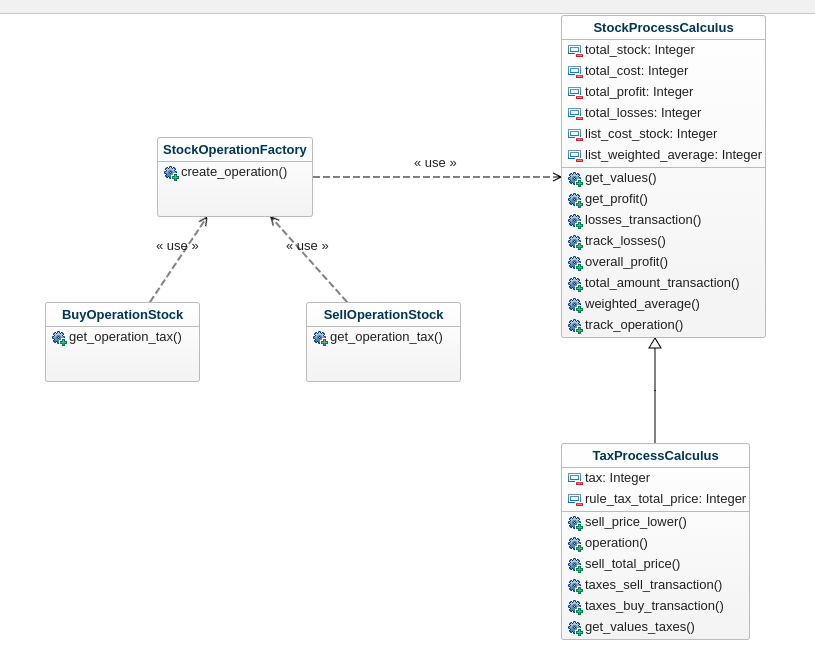

# Nu bank test

##  Technical and architectural decisions
A factory pattern was implemented to use polymorphism and be able to use the buy or sell operation or any other without 
having to change the main program (in this case view.py)



For the stock calculator it was decided to work on two classes. A class, which is 
the main calculation class, which will manage the memory of each transaction. 
The class that will handle all taxes and will inherit from the main class.
Which allows us that if other operations are required, we can create the 
classes that derive from it and carry out the other calculations.

In the BuyOperationStock and SellOperationStock classes, which the factory uses, 
they use the calculator to perform the operations: save the operations and calculate the taxes.

## Compile and run

To compile locally, run the following command

1. Install Virtualenv and activate it
```sh
$ virtualenv -p python3 venv
```
```sh
$ source venv/bin/activate
```
2. Install requirements.txt
```sh
$ pip3 install -r requirements.txt
```

3. run program
```shell
python main.py
```

4. write inside the program the word
```shell
exit
```

## Test and coverage

for run test you need execute

```shell
RUN pytest --cov=. -v -s --cov-fail-under=70 --cov-report=html
```
The folder test has a example.py file with the examples

After this, a new folder will be created with an index.html file which can be opened
in the browser and will show the coverage of each file

### docker compose 

For run docker compose use this comand

```shell
docker-compose run app_nu
```

## Technologies used

1. Python
2. Docker

